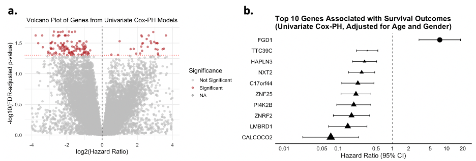
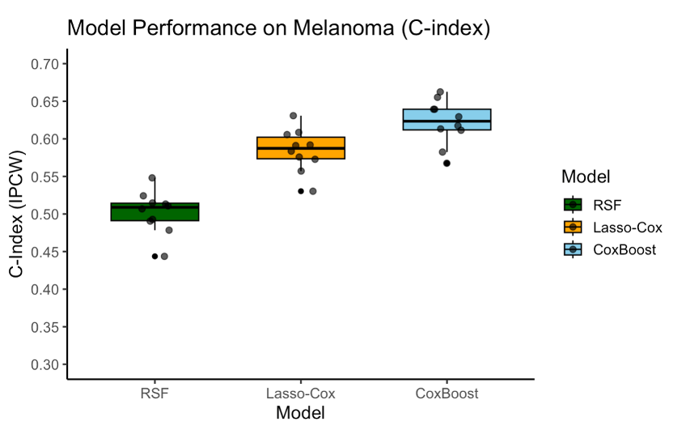
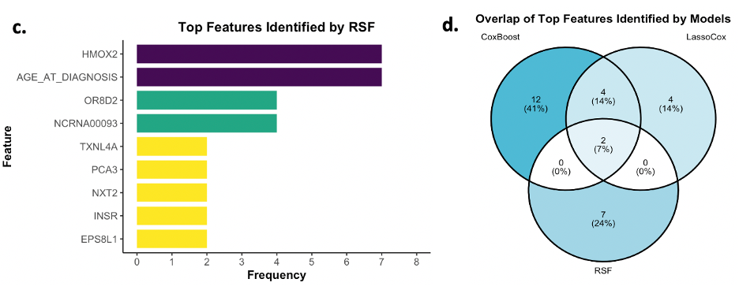
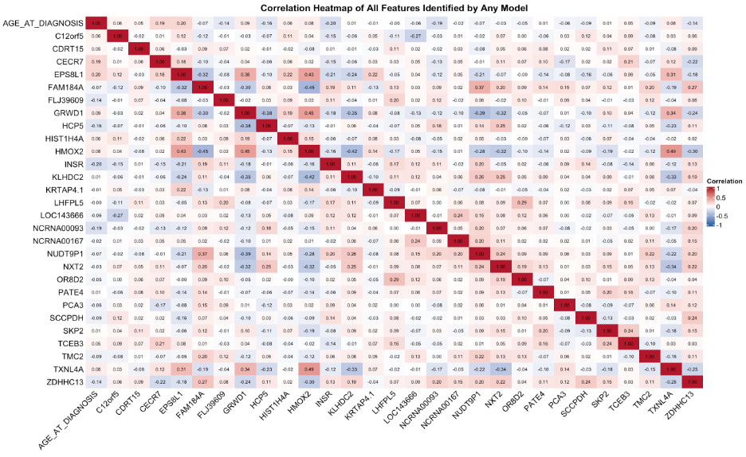

#  ML-Based Survival Modeling in Metastatic Melanoma
Machine learning–based survival prediction in metastatic melanoma using TCGA RNA-seq and clinical data.

## Overview
This project builds an end-to-end machine learning pipeline for survival prediction in metastatic melanoma, integrating high-dimensional RNA-sequencing data with clinical and pathological features from TCGA.

The goal is to compare multiple survival modeling approaches under the same data and evaluation framework, with an emphasis on predictive performance, robustness, and feature interpretability.

## Methods

### Data Source and Cohort
Individual-level RNA-seq, clinical, and pathological data were obtained from the TCGA melanoma project. The analysis focused on metastatic melanoma cases with complete survival outcomes, gene expression profiles, and key pathological features. After applying inclusion criteria, the final analytic cohort consisted of 237 patients.

### Features and Preprocessing
Predictors included normalized expression levels of ~20,500 genes from bulk RNA-seq and a set of clinical and pathological variables (age at diagnosis, gender, lymphocyte score, necrosis percentage, pigment score, and total mutation count).

Gene expression values were log-transformed to reduce skewness. Skewed pathological variables were log-transformed and standardized using z-score normalization to ensure comparability across features.

### Univariate Screening
Genome-wide univariate Cox proportional hazards models adjusted for age and gender were fitted to each gene to assess individual associations with overall survival. False discovery rate (FDR) correction was applied to account for multiple testing. Top-ranked genes from this screening step were retained for downstream modeling.

### Machine Learning Models
Three survival modeling approaches were evaluated:
- **LASSO-penalized Cox regression**
- **CoxBoost**
- **Random Survival Forest (RSF)** 

Models were trained using 5-fold cross-validation, with hyperparameters tuned within the training data.

### Model Evaluation
Predictive performance was assessed using concordance-based metrics (C-index and Uno’s C-index), which account for right-censored survival outcomes.

### Feature Importance and Stability Analysis
Permutation-based feature importance was computed for each model to quantify the contribution of individual predictors to survival prediction. To assess robustness, models were repeatedly trained on multiple random data splits, and feature stability was evaluated based on selection frequency across runs.

### Post hoc Interpretation
For features consistently identified across models, correlations among predictors were examined using Pearson correlation heatmaps. Selected biomarkers were further evaluated using Kaplan–Meier survival curves and adjusted Cox proportional hazards models to assess effect size and clinical relevance.

## Key Results

### Univariate Cox-PH Analysis of Gene Expression and Survival.
(a) Volcano plot of genome-wide univariate Cox models (~20,500 genes), showing effect size (log₂ hazard ratio) versus statistical significance (−log₁₀ FDR). Genes passing the FDR < 0.05 threshold are highlighted.
(b) Forest plot of the top 20 survival-associated genes ranked by statistical significance, with hazard ratios and 95% confidence intervals.

### Comparison of Model Performance on Metastatic Melanoma Survival Prediction.

### Key Prognostic Features Identified by Three ML Models.
(c) RSF.
(d) Venn diagram showing the overlap of top features (selected ≥ 2 times) identified by CoxBoost, Lasso-Cox, and RSF. 

### Correlation Heatmap of Prognostic Features Identified by CoxBoost, LASSO-Cox, and Random Survival Forest
The heatmap displays the Pearson correlation coefficients among all features selected by at least one of the three survival models. Color intensity indicates the strength and direction of pairwise correlations, ranging from −1 (blue, strong negative correlation) to +1 (red, strong positive correlation).

